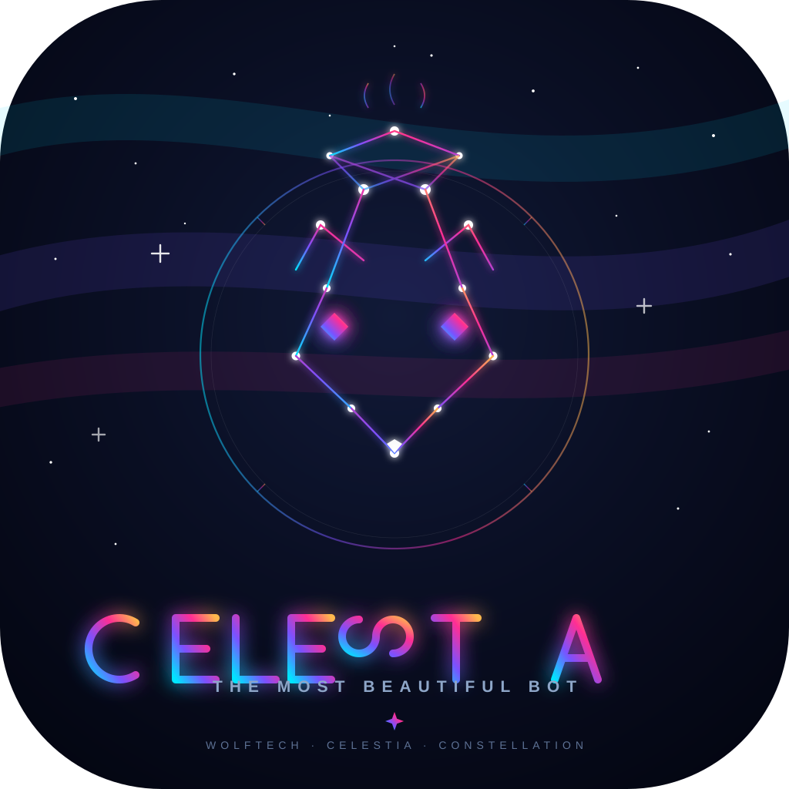

<p align="center">
  
</p>

<h1 align="center">✨ CELESTIA ✨</h1>
<p align="center"><b>The Most Beautiful WhatsApp Bot</b><br>
<i>Heavenly • VPS Hostable • Hardened • 414 Commands</i></p>

<p align="center">
  
  
  
  
</p>

---

### 🌸 What is CELESTIA?

**CELESTIA** is **The Most Beautiful WhatsApp Bot** ✨ - heavenly, VPS-hostable, hardened. 414 elegant commands, safe group tools, AI, media, automation. Built for beauty and power.

> *Heavenly elegance, beautiful power.*

---

### 🖼️ Logo

`assets/logo.svg` - 1024×1024, neon gradient `#00f5ff → #7c4dff → #ff2e93`, geometric wolf, heavenly glow. Use for profile pic, banner, README.

---

### 📦 Structure

```
CELESTIA/
├── assets/logo.svg         # heavenly logo (1024×1024)
├── index.js                # CELESTIA main (Baileys, health server)
├── commands/               # 198 files → 414 aliases
│   ├── spam.js             # .spam 10 hello (hardened)
│   ├── kill.js / kill2.js  # hardened group tools
│   ├── menu.js             # CELESTIA menu
│   └── ... auto-fetched & heavenly
├── config/config.js        # BOT_NAME=CELESTIA
├── Dockerfile / docker-compose.yml  # VPS (node:20)
└── auth_info_baileys/      # session persist
```

---

### 🚀 Quick Start

```bash
npm install
cp .env.example .env  # set OWNER_NUMBER, optional OPENAI_API_KEY/GEMINI_API_KEY
node index.js
# Scan QR in terminal → .menu on WhatsApp
```

**VPS Docker (recommended):**
```bash
docker compose up -d --build
docker logs -f celestia
# Health: http://YOUR_IP:3000/health  QR: http://YOUR_IP:3000/qr
```

---

### ✨ Commands

| Category | Example |
|----------|---------|
| **Spam** | `.spam 10 hello` |
| **AI** | `.ai hi` `.gpt` `.gemini` |
| **Media** | `.tiktok` `.ig` `.yt` `.sticker` |
| **Group** | `.antilink` `welcome` `promote` `kill` `kill2` |
| **Utility** | `.ping` `.menu` `.alive` |

`.menu` shows full heavenly list.

---

### 🔒 Hardened `kill` / `kill2`

* `kill.js:19` strict `OWNER_NUMBER` only, pending 60s, cooldown 60m, batch 15, audit `logs/`
* `kill2.js:28` fixed `_ -` invite bug, `invite/` path, query strip, pending by `inviteCode`

---

### 🎨 Branding

Update `BOT_NAME=CELESTIA` in `.env`, logo in `assets/logo.svg`. PM2: `pm2 start index.js --name celestia`.

---

<p align="center"><i>CELESTIA • The Most Beautiful Bot • Made heavenly</i></p>
