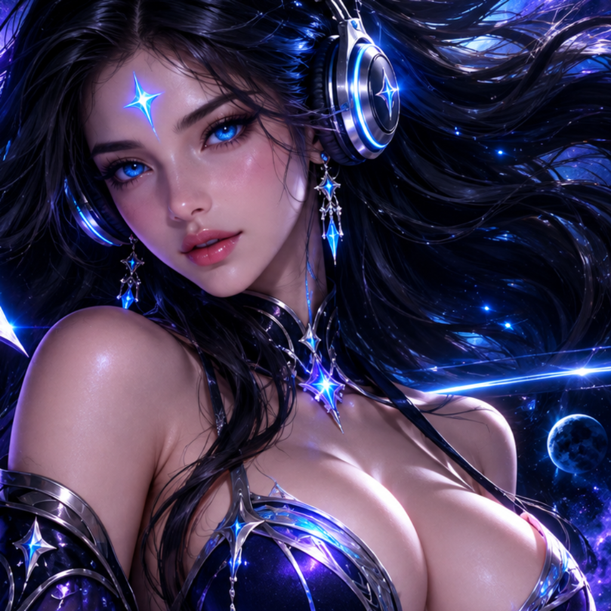

<p align="center">
  
</p>

<h1 align="center">✨ CELESTIA ✨</h1>
<p align="center"><b>The Most Beautiful WhatsApp Bot</b><br>
<i>Heavenly • VPS Hostable • Hardened • 414 Commands</i></p>

<p align="center">
  
  
  
  
  
</p>

<p align="center">
  <i>🐺 Howl of the Wolf → ✨ Light of the Stars — WolfTech howled, CELESTIA ascended.</i>
</p>

---

### 🌸 What is CELESTIA?

**CELESTIA** is **The Most Beautiful WhatsApp Bot** ✨ - heavenly, VPS-hostable, hardened. 414 elegant commands, safe group tools, AI, media, automation. Built for beauty and power.

> *Heavenly elegance, beautiful power.*
> *Forged in the Wolf's Den, Crowned in Celestial Heaven.*

---

### 🐺 Inspired by WolfTech — The Origin Howl

**CELESTIA didn't start from silence. She started from a howl.**

> Before heaven, there was the hunt. **WolfTech** prowled the dark — raw, feral, unstoppable code. It taught us to build bots that *don't kneel, don't break, don't sleep.*
> **CELESTIA** looked up and turned that hunt into *light*. 414 celestial commands, heavenly VPS armor, hardened grace. Same fang, new crown.

```
🐺 WOLFTECH gave the fang.
✨ CELESTIA gave the crown.
🌙 Together → Legend.
```

**Lineage:** `WolfTech (feral power) → CELESTIA (heavenly evolution)` — not a copy, *an ascension*.

- **WolfTech DNA:** hunt logic, spam engine, group ferocity, never-die session
- **Celestia Soul:** neon heaven aesthetic, 414 polished commands, VPS hardening, Baileys 7 elegance
- **Tribute:** Every `.ping`, `.alive`, `.menu` whispers the wolf. Try `.wolftech` to hear the full howl.

> *The Wolf hunts. The Star guides. Together, unstoppable.* — `utils/wolfTech.js`

---

### 🖼️ Logo

`assets/logo.png` - 1024×1024 official CELESTIA face (celestial goddess emblem, blue/cyan/violet/silver on black). `assets/banner.png` (1200×675 wide) and `assets/script.jpg` (menu banner) are rendered from the same art. Source: `celestia-logo.png`. Canonical prompt: `assets/LOGO-PROMPT.md`. Use for profile pic, banner, README.

---

### 📦 Structure

```
CELESTIA/
├── assets/logo.png         # official face (1024×1024, from celestia-logo.png)
├── index.js                # CELESTIA main (Baileys, health server)
├── commands/               # 198 files → 414 aliases
│   ├── spam.js             # .spam 10 hello (hardened)
│   ├── kill.js / kill2.js  # hardened group tools
│   ├── menu.js             # CELESTIA menu
│   └── ... auto-fetched & heavenly
├── config/config.js        # BOT_NAME=CELESTIA
├── Dockerfile / docker-compose.yml  # VPS (node:20)
└── auth_info_baileys/      # session persist
```

---

### 🚀 Quick Start

```bash
npm install
cp .env.example .env  # set OWNER_NUMBER, optional OPENAI_API_KEY/GEMINI_API_KEY
node index.js
# Scan QR in terminal → .menu on WhatsApp
```

**VPS Docker (recommended):**
```bash
docker compose up -d --build
docker logs -f celestia
# Health: http://YOUR_IP:3000/health  QR: http://YOUR_IP:3000/qr
```

---

### ✨ Commands

| Category | Example |
|----------|---------|
| **Spam** | `.spam 10 hello` |
| **AI** | `.ai hi` `.gpt` `.gemini` |
| **Media** | `.tiktok` `.ig` `.yt` `.sticker` |
| **Group** | `.antilink` `welcome` `promote` `kill` `kill2` |
| **Utility** | `.ping` `.menu` `.alive` |

`.menu` shows full heavenly list.

---

### 🔒 Hardened `kill` / `kill2`

* `kill.js:19` strict `OWNER_NUMBER` only, pending 60s, cooldown 60m, batch 15, audit `logs/`
* `kill2.js:28` fixed `_ -` invite bug, `invite/` path, query strip, pending by `inviteCode`

---

### 🎨 Branding

Update `BOT_NAME=CELESTIA` in `.env`, logo in `assets/logo.svg`. PM2: `pm2 start index.js --name celestia`.

---

### 🐺💫 Lineage

| Era | Entity | Essence |
|-----|--------|---------|
| 🌑 | **WolfTech** | The Hunt — feral, raw, unbreakable |
| 🌸 | **CELESTIA** | The Heaven — elegant, hardened, celestial |

> **Credit:** Inspired by **WolfTech 🐺** — the pack that showed us how to run. CELESTIA is the star that showed us where to run *to*.

---

<p align="center">
  <b>CELESTIA ✨ The Most Beautiful Bot</b><br>
  <i>Howl of the Wolf → Light of the Stars</i><br>
  <sub>🐺 Inspired by <b>WolfTech</b> • ✨ Forged as <b>CELESTIA</b> • Made heavenly</sub>
</p>
